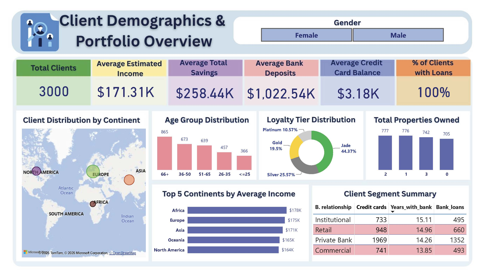
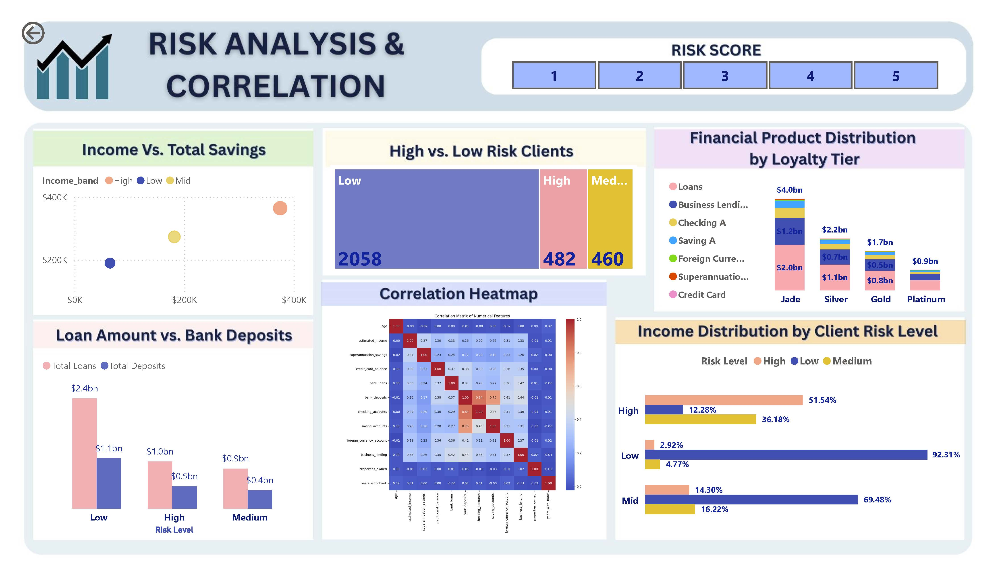
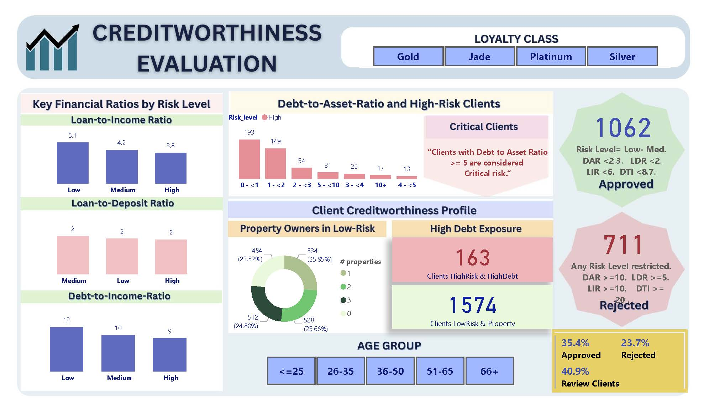

# 💳 Financial Risk Analysis Dashboard  

## 📌 Introduction  
This project focuses on **Bank Risk Analysis**, aiming to evaluate the probability of a client representing a financial risk for the bank.  

It addresses key questions such as:  
- Will the customer default on a loan?  
- Does the client have enough assets to cover liabilities?  
- Is the financial behavior stable or risky?  
- What is the exposure across financial products?  

By answering these questions, financial institutions can make better decisions on:  
- Loan approvals  
- Credit card limits  
- Customer loyalty strategies  
- Interest rates & loan conditions  

---

## 🎯 Project Objective  
Develop an end-to-end **risk analytics solution** using:  
- **Python** → Data cleaning, feature engineering, exploratory analysis  
- **Power BI** → KPI tracking, interactive dashboards, creditworthiness evaluation  

The goal is to enable banking institutions to minimize the risk of financial losses while lending.  

---

## ⚙️ Tools & Technologies  
- **Python** → Pandas, Matplotlib, Seaborn  
- **Power BI Desktop** → Dashboards & reports  
- **GitHub** → Documentation & project sharing  

---

## 📊 Dashboard Overview   

### Page 1 – Client Demographics & Portfolio Overview  
- Distribution of clients by **Gender, Nacionality & Loyalty distribution**   
- Key metrics: Averages of Estimated Income, Savings, Deposits and Loans

 
 
### Page 2 – Risk Analysis and Correlations  
- Breakdown of financial products across **Risk Level**  
- Comparison of income, deposits, loans, savings.
- Correlation of numerical variables
  


### Page 3 – Creditworthiness Evaluation  
- KPIs: Debt-to-Income Ratio, Debt-to-Asset Ratio, Loan Ratios  
- **Approval / Review / Rejection** classification model  
- Client segmentation with filters (Age Group, Loyalty Tier)

 

You can explore the **Power BI report** here:  

➡️ [Download Bank Risk Dashboard (.pbix)](Bank-Risk-Analysis-Dashboard/Report/Risk_Analysis_Dashboard.pbix)

---
## 📁 Project Structure
- `Bank_Risk_analysis.ipynb` – Python notebook with integrated data, cleaning, Metric calculations, Correlations and analysis  
- `Excel_CSV_Tables/` – Processed data exported for dashboard building  
- `Images/Portafolio_project.pbix` – Power BI Dashboard - report file
- `Insights_from_Data` - Pdf document summarizing the key findings from the analysis. 
  
📘 See the full analysis steps in this notebook:  
👉 [View the Jupyter notebook](Bank-Risk-Analysis-Dashboard/Notebooks/Bank_Risk_Analysis.ipynb)

---

## 📈 Insights from Data & conclusion
Completing this project has been a significant personal achievement. 
Designing meaningful **KPIs for bank risk analysis**, integrating Python for data preparation, and building an **interactive Power BI dashboard** gave me hands-on experience with real financial data challenges.
This work has sharpened my **analytical thinking**, strengthened my technical skills in both **Python and Power BI**, and deepened my **understanding of risk evaluation** in the banking industry. It represents a clear step forward in my professional growth as a **data analyst** and demonstrates the value I can bring to future financial analytics projects.


📘 See full analysis in this report:  
👉 [View the full Report ](Bank-Risk-Analysis-Dashboard/Report/Risk_Analysis_Report.pdf)

---

## 🚀 How to Run the Project  

1. Clone this repository:  
   ```bash
   git clone https://github.com/yourusername/Bank-Risk-Analysis-Dashboard.git
   cd Bank-Risk-Analysis-Dashboard
